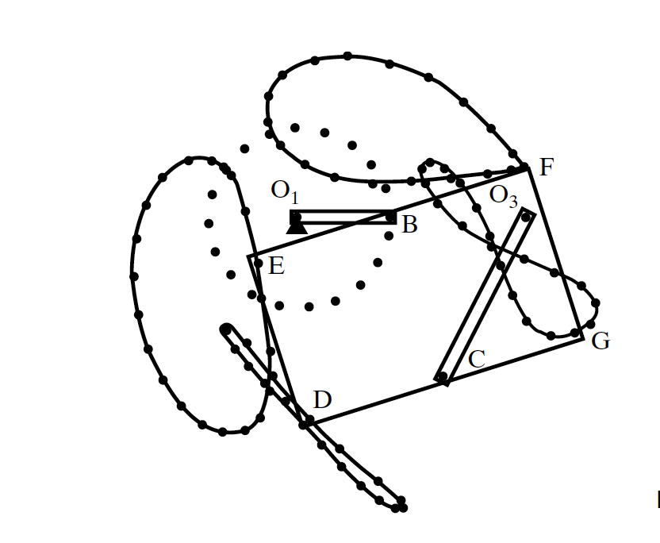

# ME 374 Extra Credit 1
The goal is to simulate the described motion given by the textbook.



The rectangle (EDGF) was defined by an angle (alpha), which is the angle between EF and the horizontal axis. To make this task easier, the imaginary link BC was created to simulate a 4 bar linkage. The motion of the rectangle was then described with respect the link BC.
<br /><br />
## Getting Started
This simulation was tested and ran with Python (3.8.7)
## Files included
* `main.py`
* `closer.py`
* `rect.py`

## Setup
[Python3](https://www.python.org/downloads/) should be installed and used
### Necessary Libraries
Make sure these libraries are installed:

* numpy
* scipy
* and matplotlib
```bash
pip install numpy scipy matplotlib
```

## Install and Run
The files can be downloaded via git clone:
```bash
git clone https://github.com/nono0410/ME374-EC1.git
```
Ensure that all files are included within the same folder
To run the simulation, launch Terminal and open the folder with the Python codes.
```bash
cd ~/ME374-EC1
```
Run the `main.py` file:
```bash
python main.py
```
## Author
* [**Nagahiro Ohashi**](https://github.com/nono0410)
